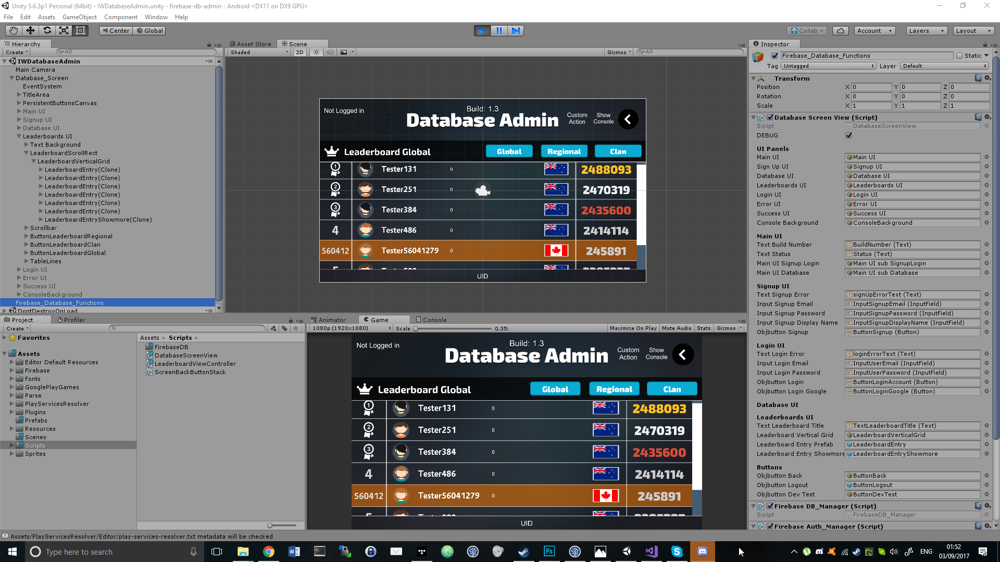

# Unity-Firebase-Leaderboard-Scripts-Only.-SHOWCASE

My C# Unity Classes for a Google Firebase Database with UI handling and Authentication

SHOWCASE ONLY, COPYRIGHT TO MEDIAHIVE LIMITED, AUTHOR SEAN Z

LICENSING PLEASE CONTACT: secure[emailsymhere]eozmon[lotcom]

